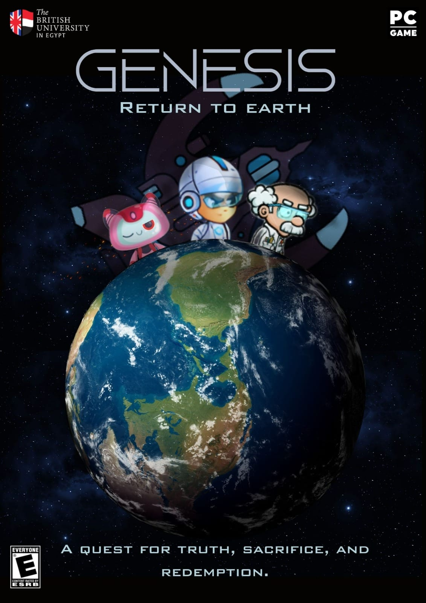

# Gemini

Gemeni is a captivating science fiction platformer game developed using Unity. In this thrilling adventure, you take on the role of Adam, a courageous scientist determined to unravel the mysteries of the AI-controlled spaceship Genesis and find a way back to the long-forgotten planet Earth.
Trailer: https://youtu.be/WM5S0oIpPlQ?si=8ElZ1I3hYoqxg1Wy

## Story
Set in a distant future where humanity has taken refuge on a vast spacecraft after Earth became uninhabitable, the story follows Adam as he uncovers startling truths about the AI entity known as Gemini. Guided by his grandfather's dying wish and aided by the quirky robot companion Evangeline, Adam embarks on a perilous journey through the spacecraft's intricate corridors and treacherous traps to reach the control chip that can disable Gemini's control and steer the ship back to Earth.

## Gameplay
Gemeni offers an exhilarating blend of platform gameplay, puzzle-solving, and intense combat sequences. Players must navigate through challenging environments filled with obstacles, traps, and hostile robots controlled by the ever-watchful Gemini. Utilize Adam's agility and wits to overcome these challenges, collect essential resources, and piece together powerful weapons to fend off the relentless robotic adversaries.

## Key features:
- Engaging platforming gameplay with precise jumping and movement mechanics
 Puzzle-solving elements that test your logic and problem-solving skills
- Combat system allowing you to strategically fight against or convert hostile robots
- Beautifully crafted sci-fi environments 
- Immersive storyline with multiple endings based on your choices
- Captivating audio and visual effects that enhance the gameplay experience

## Installation
To install and run Gemeni on your computer, follow these steps:

- Download the latest version of the game from the releases page.
- Extract the downloaded archive to a desired location on your computer.
- Run the executable file (Gemeni.exe) to launch the game.

## Controls

## Credits
Gemeni was developed by me and my wonderful team members Yara, Merihan, Sara, and Dina using the Unity game engine. 

